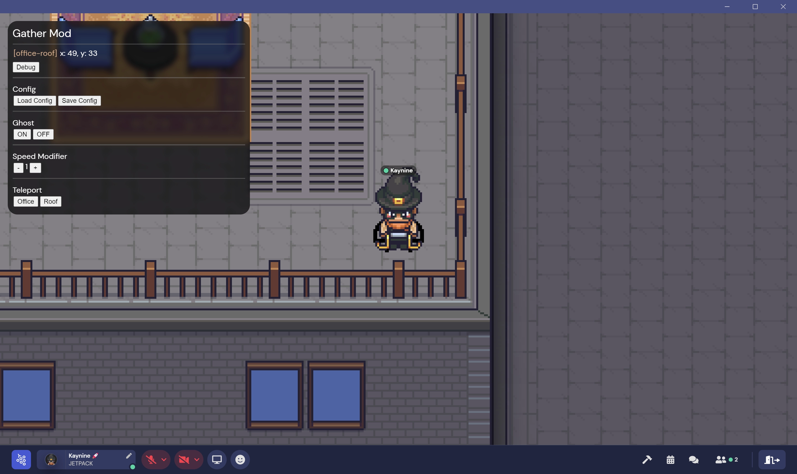

# Gather Mod

A collection of client-side mods for [gather.town](https://www.gather.town).

⚠️ Work in progress

## Screenshot



## Features

- Mod UI popup (press the `End` hotkey to open)
- Config save/load
- Show map and coordinates info
- Teleport to a specific location or user
- Change the speed modifier
- Permanent Ghost toggle (without holding the `G` key)

## Usage

Build the project using `npm run build`.

### Desktop (Electron App)

You can use [`electron-injector`](https://github.com/itsKaynine/electron-injector) to inject the script for Desktop version:

```sh
electron-injector --script="/path/to/gather-mod/dist/index.js" "/path/to/gather-app"
```

### Web Browser

> Note: In the future, the project could be packaged as a Chrome Extension.

Open the Chrome Console:

- Windows & Linux: Press `Ctrl + Shift + J`
- Mac: Press `Cmd + Opt + J`

Then paste the contents of `gather-mod/dist/index.js` into the console and press Enter to run the code (before the page is fully loaded).

---

## Config

> Note: Not all settings are currently exposed in the UI. You can set the configuration directly in the console.

```js
window.__GATHER_MOD_CONFIG = {
    // For debugging
    verbose: false,
    // Teleport presets
    teleportPresets: [
        // Teleport to location
        {
            name: 'Meeting Room',
            args: {
                type: 'location',
                mapId: 'office-main',
                x: 50,
                y: 20,
            },
        },
        // Teleport to user
        {
            name: 'Meeting Room',
            args: {
                type: 'user',
                query: {
                    name: 'Kaynine',
                },
            },
        },
    ],
    // Change the popup toggle key
    togglePopupKey: 'End',
    // Override popup CSS
    overridePopupCss: undefined,
    // Override popup HTML
    overridePopupHtml: undefined,
};
```

## Scripts

### Build

Build using `esbuild`:

```sh
npm run build
```

### Lint

Lint using `eslint`:

```sh
npm run lint
```

## Format

Format the project using `prettier`:

```sh
npm run format
```
